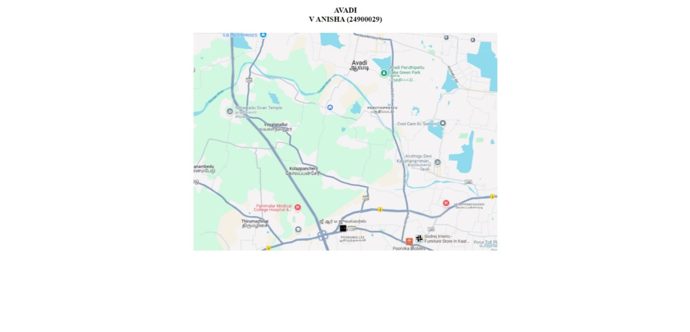

# Ex04 Places Around Me
## Date: 17.11.2024

## AIM
To develop a website to display details about the places around my house.

## DESIGN STEPS

### STEP 1
Create a Django admin interface.

### STEP 2
Download your city map from Google.

### STEP 3
Using ```<map>``` tag name the map.

### STEP 4
Create clickable regions in the image using ```<area>``` tag.

### STEP 5
Write HTML programs for all the regions identified.

### STEP 6
Execute the programs and publish them.

## CODE
```
map.html

<DOCTYPE! html>
<html>
    <head>
        <title>My City</title>
    </head>
    <body>
        <br>
        <font style="font-family: 'Times New Roman', Times, serif; font-size: xx-large;">
        <center><b>AVADI<br>
        V ANISHA (24900029)</b></center><br>
    </font>
        <center>
            
            <map name="MyCity">
                <area target="_blank" href="PARK.html" coords="780,150,820,180" title="Lake Park" shape="rect">
                <area target="_blank" href="home.html" coords="550,300,590,330" title="My Home" shape="rect">
                <area target="_blank" href="TEMPLE.html" coords="135,315,165,345" title="Sitharkadu Sivan Temple" shape="rect">
                <area target="_blank" href="PANIMALR.html" title="Panimalar Medical College and Hospital" coords="420,650,450,750" shape="rect">
                <area target="_blank" href="ACS.html" title="ACS Medical College and Hospital" coords="1045,700,1075,730" shape="rect">
            </map>
        </center>
    </body>

</html>

home.html

<html>
    <head>
        <title>MY HOME</title>
    </head>>
    <body background="bg/18.jpg" >
        <center>
        <h1 align="center">My Home</h1>
        <hr></center>
        <font style="font-family:monospace, Courier, monospace; ">
            <pre>
                <h3><b>          ADDRESS</b></h3>            6/392, Shanmugha Muthaliar Street,
            Ashok Nandavanam, Kannapalayam, 
            Avadi, Tamil Nadu.
            Pincode - 600071.
            <p>
            <b>ABOUT</b><br>
            Home is often considered a feeling rather than just a physical place because it involves a complex set of psychological, 
            emotional and philosophical aspects that go beyond the mere location of a building or structure.
            A home is a sanctuary where we feel safe and comfortable. Emotional attachment to this space cultivates a sense of security, both physically and emotionally. 
            </p><center>
            <H3><B>         IMAGES</B></H3></font>
               
        <br>
        <br>
    </center>
    </pre>

    </body>
</html>

panimalar.html

<html>
    <head>
        <title>Panimalar Medical College and Hospital</title>
    </head>>
    <body background="bg/10.jpg">
        <center>
        <h1 align="center">Panimalar Medical College and Hospital</h1>
        <hr></center>
        <font style="font-family:monospace, Courier, monospace; ">
            <pre>
                <h3><b>          ADDRESS</b></h3>            Varadharajapuram, Chennai Outer Ring Rd, 
            Poonamallee, Chennai, 
            Banaveduthottam, Tamil Nadu.
            Pincode - 600123.
            <p>
            <b>ABOUT</b>

            Panimalar Medical College Hospital & Research Institute is a Christian Minority Institution
            of Higher Education established and governed by the “Jaisakthi Educational Trust”, Chennai.
            The College is well-equipped with the state of the art infrastructure, technology-enabled smart classrooms, 
            advanced laboratories and continually focuses on teaching, clinical practice, and research.
            </p><center>
            <H3><B>         IMAGES</B></H3></font>
              
        </center>

    </pre>

    </body>
</html>

temple.html

<html>
    <head>
        <title>Sitharkadu Sivan Temple</title>
    </head>>
    <body background="bg/19.jpg" >
        <center>
        <h1 align="center">Sitharkadu Sivan Temple</h1>
        <hr></center>
        <font style="font-family:monospace, Courier, monospace; ">
            <pre>
                <h3><b>          ADDRESS</b></h3>            Sitharkadu Sivan Temple,
            Thirumanam Village, Via, Poonamallee - Pattabiram Rd, 
            Sitharkadu, Soranjeri, Tamil Nadu.
            Pincode - 600072.
        <p>
            <b>ABOUT</b>

            A temple (from the Latin templum) is a place of worship, 
            a building used for spiritual rituals and activities such as prayer and sacrifice. 
            By convention, the specially built places of worship of some religions
            are commonly called "temple" in English, while those of other religions are not, 
            even though they fulfill very similar functions.   
        </p><center>
        <H3><B>         IMAGES</B></H3></font>
          
    </center>
        </pre>
    </body>
</html>


acs.html

<html>
    <head>
        <title>A C S MEDICAL COLLEGE AND HOSPITAL</title>
    </head>>
    <body background="bg/17.jpg" >
        <center>
        <h1 align="center">A C S MEDICAL COLLEGE AND HOSPITAL</h1>
        <hr></center>
        <font style="font-family:monospace, Courier, monospace; ">
            <pre>
                <h3><b>          ADDRESS</b></h3>            A C S MEDICAL COLLEGE AND HOSPITAL, 
            Poonamallee High Rd, Velappanchavadi, 
            Chennai, Tamil Nadu.
            Pincode -  600077.
        <p>
            <b>ABOUT</b>

            ACS Medical College and Hospital offers medical services to majority of urban and rural people. 
            The hospital have state of art facilities to manage wide range of medical and 
            surgical conditions and well equipped laboratories round the clock. 
            The institute is involved in community health services and provides services for needy people.
        </p><center>
        <H3><B>         IMAGES</B></H3></font>
          
    </center>
        <br>
        <br>
        <br>
    </pre7

    </body>
</html>

park.html

<html>
    <head>
        <title>Avadi Paruthipattu Lake Green Park</title>
    </head>>
    <body background="bg/14.jpg" >
        <center>
        <h1 align="center">Avadi Paruthipattu Lake Green Park</h1>
        <hr></center>
        <font style="font-family:monospace, Courier, monospace; ">
            <pre>
            <h3><b>          ADDRESS</b></h3>            4434+263, Kamaraj Nagar 4th Main Rd,
            Ram Nagar, Kamaraj Nagar,
            Avadi, Tamil Nadu.
            Pincode - 600071.
        <p>
            <b>ABOUT</b>

            Paruthipattu Lake, also known as Avadi Lake, is a lake in Chennai, Tamil Nadu, India. 
            It is located in the Avadi locality of Chennai. It is the second eco-park in the city after Chetput Lake.  
        </p><center>
        <H3><B>         IMAGES</B></H3></font>
          
        <br>
        <br></center>
    </pre>

    </body>
</html>
```

## OUTPUT



## RESULT
The program for implementing image maps using HTML is executed successfully.
